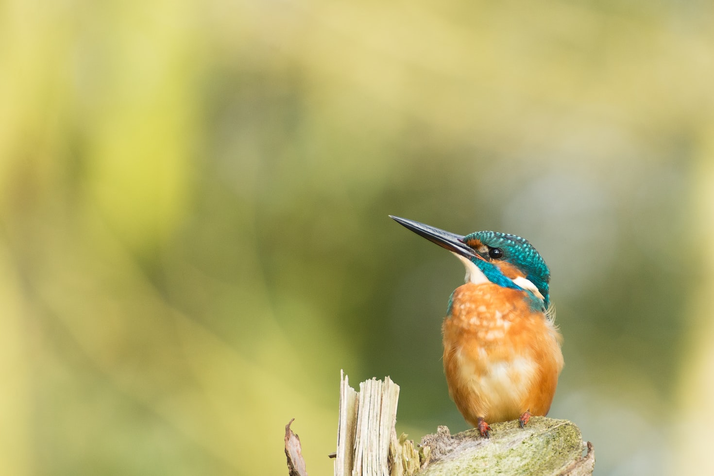

# Classify kingfisher species using deep learning.

Test the app [here](https://mybinder.org/v2/gh/mastoffel/kingfisher_classifier/HEAD?urlpath=%2Fvoila%2Frender%2Fkingfisher_app.ipynb) (note: will take a little moment)

*The model was built using transfer learning based on a resnet32 architecture*
